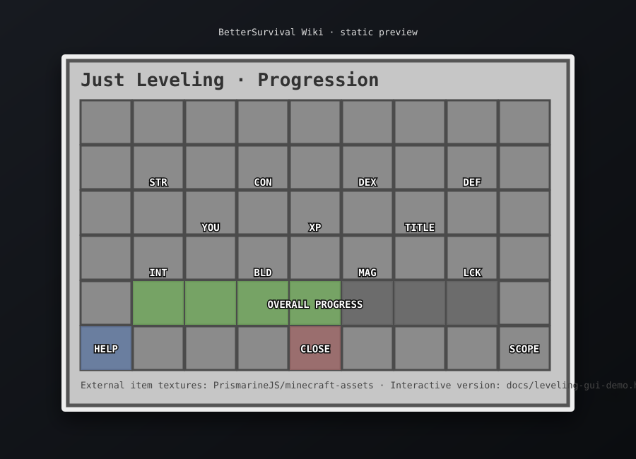

# Just Leveling ChestGUI

ゲーム内の `LevelingSystemModule#open` と同じ 9×6 構成を Wiki 用に視覚化したページです。

## 試してみる

**[Interactive ChestGUI Mock を開く](leveling-gui-demo.html)**

ブラウザ版では次を試せます。

- Minecraft XP level を自由に変更
- `New Player` / `Mid Game` / `End Game` のサンプル進行度切替
- STR / CON / DEX / DEF / INT / BLD / MAG / LCK を実際にクリック
- 実装と同じ `5 + floor(currentLevel / 2)` で疑似レベルアップ
- XP不足 / 最大Lv32 の状態確認
- 称号・Help・Close・Otherworld scope の説明確認

## ゲーム内スロット

| Slot | 表示 | 動作 |
| ---: | --- | --- |
| 10 | STR 筋力 | クリックで筋力 +1 |
| 12 | CON 体力 | クリックで体力 +1 |
| 14 | DEX 敏捷 | クリックで敏捷 +1 |
| 16 | DEF 防御 | クリックで防御 +1 |
| 20 | Player Head | 能力値合計、scope、選択称号 |
| 22 | XP Bottle | 現在の Minecraft XP level |
| 24 | Name Tag | 称号一覧へ移動 |
| 28 | INT 知力 | クリックで知力 +1 |
| 30 | BLD 建築 | クリックで建築 +1 |
| 32 | MAG 魔力 | クリックで魔力 +1 |
| 34 | LCK 幸運 | クリックで幸運 +1 |
| 37–43 | Overall Progress | 8能力値合計の7分割進行バー |
| 45 | Help | GUIの使い方 |
| 47 | Leveling Book | Bookの入手・用途説明 |
| 49 | Barrier | GUIを閉じる |
| 51 | Ender Eye | Otherworld profile scope |

## 外部画像

静的SVGとInteractive MockのMinecraft item textureは、外部の [PrismarineJS/minecraft-assets](https://github.com/PrismarineJS/minecraft-assets) の `data/1.21.8/items/` をURL参照しています。BetterSurvivalリポジトリへMinecraft textureのバイナリコピーは追加していません。

ゲーム仕様そのものは [LEVELING_SYSTEM.md](LEVELING_SYSTEM.md) を参照してください。
